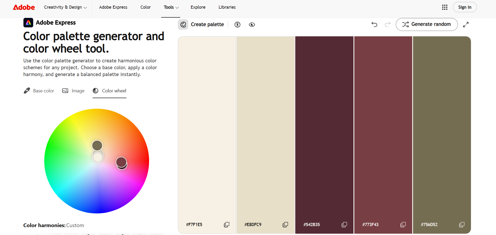

Sohrob Niazi Personal Portfolio

Website links
 Live website: https://sohrob416.github.io/sohrob-portfolio/
 GitHub repository: https://github.com/Sohrob416/sohrob-portfolio

About this website
This portfolio introduces me it talks about my education, hobbies ,school projects, work and more. It has four pages:
 index.html: home page and introduction where it explains a little bit about me what this website is and where to view my projects.
 about.html: This page goes more into detail about me there is also a photo of me alongside a video where I go into detail about myself.
 projects.html: This page shows some of the projects I've created over the years which include: Java racing game, Java hotel reception program, networking topology and Java mines game.
 contact.html: This page includes a form with name, email, cell number and comments in case you have any questions and want to contact me. 

Class examples used

 Class examples were used in making the website. Week 1 assisted in making the layout and navigation and colours. Week 2 assisted me in embedding the video and the video controls. Week 3      helped in making the page design, contact form and layout for various screen sizes. I used inline-block and line height from week 4.

Responsive layout
 All pages have their styles using css/style.css file. Separate CSS files were created for phone, tablets, and laptop displays. For the phone display, the links of the menu appear one  below the other in a vertical order. For the tablet display, the menu will be along the top. The menu appears on the left while the content is shown on the right side on the laptop display.Percentage widths help the website adjust to different screen sizes.

Colour scheme
 I used a custom palette in Adobe Color with these five colours:
 #F7F1E5: cream background.
 #E8DFC9: sand panels and footer.
 #542B35: dark burgundy.
 #773F43: muted red.
 #756D52: olive borders.
 

 The cream and sand colors create a warm background. Burgundy color emphasizes navigation and buttons. The olive color is for the borders. The dark brown color is for the body text.
 Georgia font is used throughout. The borders separate the projects.
 
Gradients
 The page background fades from darker cream to lighter cream. The header fades diagonally from dark burgundy to muted red at 135 degrees. Both gradients are in css/style.css.

Contact form
 The form uses required fields and an email input for browser validation. The phone field requires exactly 10 digits, with no spaces.
 Tel, pattern, and title were used for phone validation website used for this: (https://developer.mozilla.org/en-US/docs/Web/HTML/Reference/Elements/input/tel?utm_source)
 
The form uses mailto and the method used in the class example. It will open up the visitor's configured email program and the visitor has to send the email from there.

Testing
 There were no issues identified in Nu HTML Checker while validating all four HTML pages; the About page was validated a second time after inserting the written introduction.
 CSS validation checks did not detect any errors.
 W3C Link Checker did not detect any HTTP links to be broken in the results analyzed; however, it was unable to validate the mailto link since email-link checking is disabled.
 WAVE did not detect any errors or contrast errors in all four pages.
 WAVE detected the video on the About page to be reviewed manually for accessibility.
 WAVE also detected a redundant email link on the Contact page. The redundant link was modified; however, the warning persisted in the last result examined.
 Spelling has been manually verified and Grammarly was used .

Media and remaining checks
The photo and introduction video are my own. The poster image is a frame from the video. A written introduction summary is included below the video.

Final checks still needed: mobile, tablet and laptop layouts, keyboard navigation and video playback.

Publishing
The website is hosted with GitHub Pages from the main branch and root folder. Files and later changes were committed and pushed using Git commands.

Open locally
Open index.html in a browser. Keep the HTML files, css folder and media folder together.